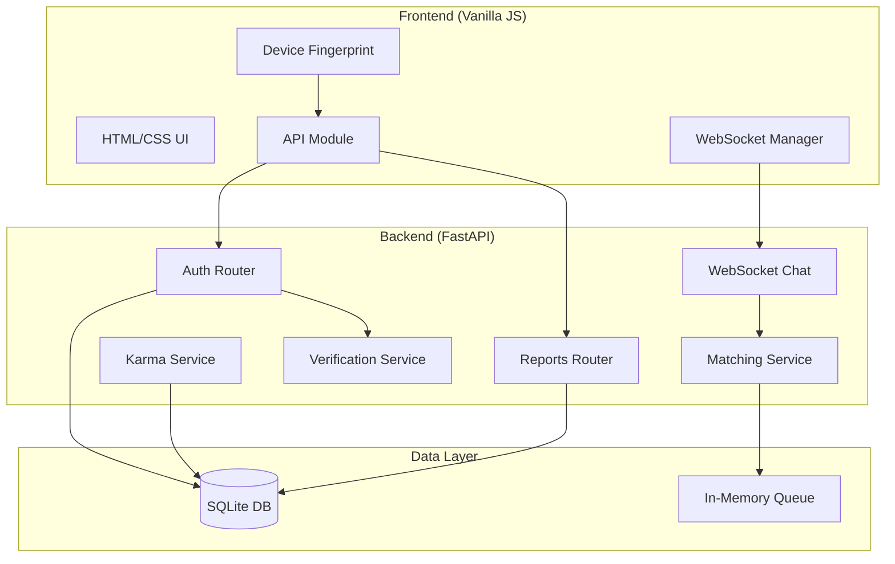
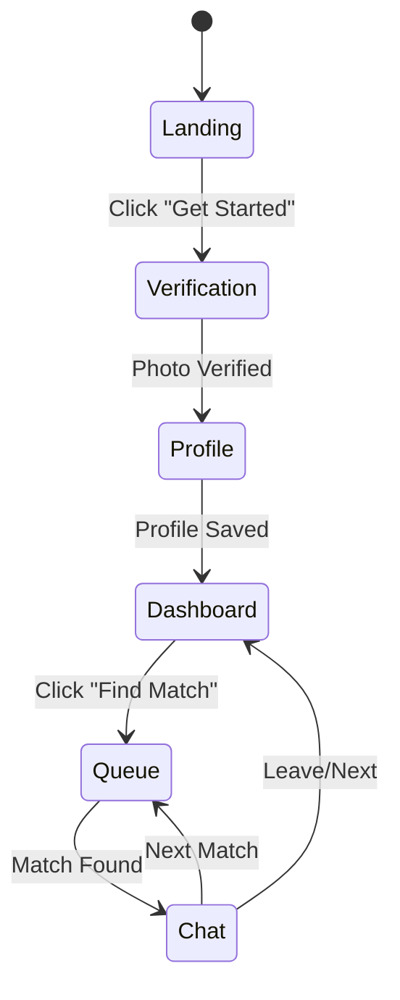
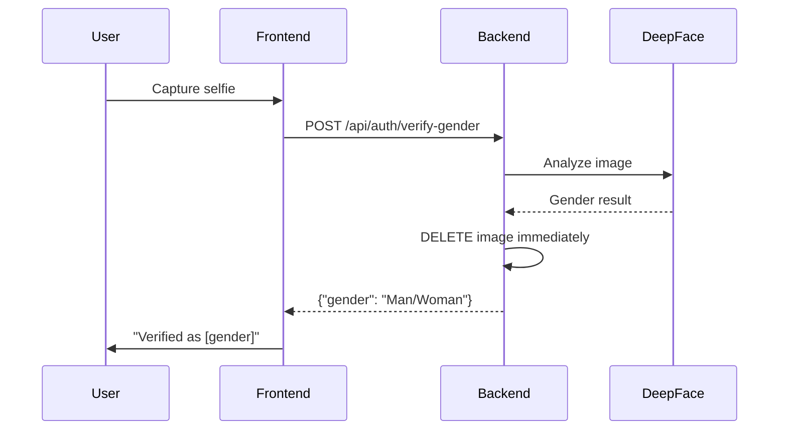
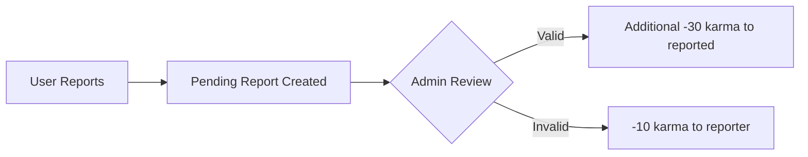

# Controlled Anonymity - Product Requirements Document

## 1. Overview

**Controlled Anonymity** is a privacy-focused anonymous chat application that enables users to have real-time conversations while maintaining safety through AI verification and a karma-based reputation system.

### Core Philosophy
> **"Chat freely. Stay safe. Remain anonymous."**

The app balances two seemingly opposing goals:
- **Complete Anonymity**: No email, phone, or personal data required
- **Safety & Accountability**: AI verification and karma system prevent abuse

---

## 2. Architecture



---

## 3. User Flow



### 3.1 Screens

| Screen | Purpose |
|--------|---------|
| **Landing** | Welcome page with feature highlights |
| **Verification** | Camera-based gender verification (AI powered) |
| **Profile** | Nickname & bio setup |
| **Dashboard** | Match filters, karma display, find match button |
| **Queue** | Animated waiting screen while matching |
| **Chat** | Real-time messaging with partner |

---

## 4. Core Features

### 4.1 Anonymous Onboarding

**No PII Required** - Users are identified solely by a device fingerprint hash.

```
Device Fingerprint Flow:
1. Generate UUID → Store in localStorage
2. Hash with SHA-256 → 64-character device_id
3. Use device_id for all API calls
```

**Privacy Guarantees:**
- No email or phone number collected
- No IP address stored
- Device ID is hashed (one-way)

---

### 4.2 AI Gender Verification

**Purpose:** Prevent fake profiles and enable gender-based matching filters.



**Privacy Guarantees:**
- ✅ Image processed in-memory only
- ✅ Temporary file deleted immediately after processing
- ✅ Only gender result ("Man" or "Woman") is stored
- ✅ No facial data, embeddings, or images retained

---

### 4.3 Karma System

A reputation system that rewards good behavior and penalizes abuse.

#### Karma Values

| Action | Karma Change |
|--------|-------------|
| Initial karma | +100 |
| Daily login bonus | +1 |
| Chat completed without report | +2 |
| Being reported | -15 |
| Report verified against user | -30 |
| Submitting false report | -10 |

#### Access Levels

| Karma Range | Access Level | Restrictions |
|-------------|--------------|--------------|
| ≥100 | **Full** | All features |
| 50-99 | **Standard** | All features |
| 25-49 | **Warning** | Warning displayed |
| 1-24 | **Temp Ban** | Cannot use matching |
| 0 | **Permanent Ban** | Account locked |

---

### 4.4 Matching System

Real-time queue-based matching with filter preferences.

#### Match Filters

| Filter | Description | Daily Limit |
|--------|-------------|-------------|
| **Anyone** | Match with any gender | Unlimited |
| **Women** | Match only with verified women | 5/day |
| **Men** | Match only with verified men | 5/day |

#### Matching Logic

```python
# Compatibility check
if user_looking_for == "any" or user_looking_for == partner_gender:
    if partner_looking_for == "any" or partner_looking_for == user_gender:
        # MATCH!
```

---

### 4.5 Real-Time Chat

WebSocket-based ephemeral messaging.

#### WebSocket Message Types

**Client → Server:**
```json
{"type": "join_queue", "looking_for": "any|male|female"}
{"type": "leave_queue"}
{"type": "send_message", "content": "Hello!"}
{"type": "leave_chat"}
{"type": "next_match", "looking_for": "any"}
```

**Server → Client:**
```json
{"type": "queued", "looking_for": "any"}
{"type": "match_found", "partner": {"nickname": "...", "bio": "..."}}
{"type": "message", "from": "partner", "content": "...", "timestamp": "..."}
{"type": "partner_left"}
{"type": "error", "message": "..."}
```

**Ephemeral Design:**
- Messages are NOT stored in database
- No chat history retained
- When chat ends, messages are gone forever

---

### 4.6 Reporting System

Users can report inappropriate behavior.

#### Report Reasons
- Harassment or bullying
- Inappropriate content
- Spam or scam
- Other (with details)

#### Report Flow


---

## 5. Technical Stack

### Frontend
| Technology | Purpose |
|------------|---------|
| HTML5 | Structure |
| CSS3 | Styling (glassmorphism, animations) |
| Vanilla JavaScript | Logic, no framework dependencies |
| WebSocket API | Real-time communication |
| MediaDevices API | Camera access |
| Web Crypto API | SHA-256 hashing |

### Backend
| Technology | Purpose |
|------------|---------|
| FastAPI | REST API & WebSocket server |
| SQLAlchemy | ORM for database |
| SQLite | Lightweight database |
| DeepFace | AI gender detection |
| Pydantic | Request/response validation |

---

## 6. Database Schema

### UserSession Table
```sql
CREATE TABLE user_sessions (
    id INTEGER PRIMARY KEY,
    device_id VARCHAR(64) UNIQUE NOT NULL,  -- Hashed device fingerprint
    gender_result VARCHAR(10),               -- "Man" or "Woman"
    nickname VARCHAR(50),
    bio VARCHAR(200),
    karma_score INTEGER DEFAULT 100,
    daily_matches_count INTEGER DEFAULT 0,
    daily_specific_filter_count INTEGER DEFAULT 0,
    last_verified_at DATETIME,
    last_active_date DATETIME,
    created_at DATETIME
);
```

### Reports Table
```sql
CREATE TABLE reports (
    id INTEGER PRIMARY KEY,
    reporter_device_id VARCHAR(64) NOT NULL,
    reported_device_id VARCHAR(64) NOT NULL,
    reason VARCHAR(500) NOT NULL,
    status ENUM('pending', 'verified', 'rejected'),
    created_at DATETIME,
    resolved_at DATETIME
);
```

---

## 7. API Endpoints

### Authentication & Profile

| Method | Endpoint | Description |
|--------|----------|-------------|
| POST | `/api/auth/register` | Register device, get/create user |
| POST | `/api/auth/verify-gender` | Upload selfie for AI verification |
| PUT | `/api/auth/profile` | Update nickname and bio |
| GET | `/api/auth/me` | Get current user info |

### Reports

| Method | Endpoint | Description |
|--------|----------|-------------|
| POST | `/api/reports/submit` | Submit a report against user |
| POST | `/api/reports/chat-complete` | Mark chat as completed (karma +2) |
| GET | `/api/reports/karma` | Get current karma score |

### WebSocket

| Endpoint | Description |
|----------|-------------|
| `/ws/chat/{device_id}` | WebSocket connection for matching & chat |

---

## 8. File Structure

```
c:\ton\
├── backend/
│   ├── app/
│   │   ├── main.py              # FastAPI app entry point
│   │   ├── config.py            # Configuration constants
│   │   ├── database.py          # SQLAlchemy setup
│   │   ├── models.py            # Database models
│   │   ├── routers/
│   │   │   ├── auth.py          # Auth & profile endpoints
│   │   │   ├── reports.py       # Reporting endpoints
│   │   │   └── ws_chat.py       # WebSocket handler
│   │   └── services/
│   │       ├── karma.py         # Karma system logic
│   │       ├── matching.py      # Queue & matching logic
│   │       └── verification.py  # DeepFace integration
│   └── requirements.txt
│
├── frontend/
│   ├── index.html               # Main HTML (all screens)
│   ├── styles.css               # All styling
│   ├── app.js                   # Main application logic
│   ├── api.js                   # API & WebSocket clients
│   └── device-fingerprint.js    # Device ID generation
│
├── run-backend.bat              # Backend startup script
├── run-frontend.bat             # Frontend startup script
└── PRD.md                       # This document
```

---

## 9. Running the Application

### Start Backend
```bash
cd backend
python -m uvicorn app.main:app --reload --host 0.0.0.0 --port 8000
```

### Start Frontend
```bash
cd frontend
python -m http.server 3000
```

### Access
- **Frontend:** http://localhost:3000
- **Backend API:** http://localhost:8000
- **API Docs:** http://localhost:8000/docs

---

## 10. Security & Privacy Summary

| Aspect | Implementation |
|--------|----------------|
| **Identity** | Device fingerprint hash only, no PII |
| **Photos** | Deleted immediately after AI analysis |
| **Messages** | Ephemeral, never stored |
| **Matching** | In-memory queues, no history |
| **Accountability** | Karma system tracks behavior patterns |
| **Safety** | Report system with verification |

---

## 11. Future Enhancements

- [ ] Redis integration for distributed matching
- [ ] Admin dashboard for report review
- [ ] Voice/video chat support
- [ ] Interest-based matching
- [ ] Premium features (more daily filters)
- [ ] Mobile app (React Native)
